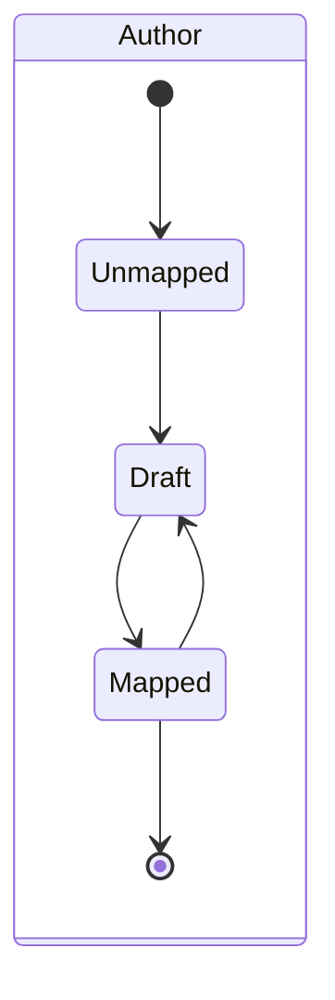
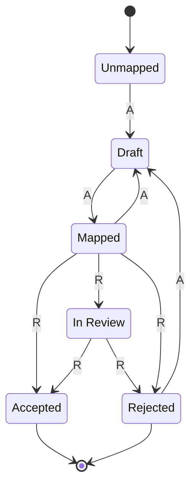
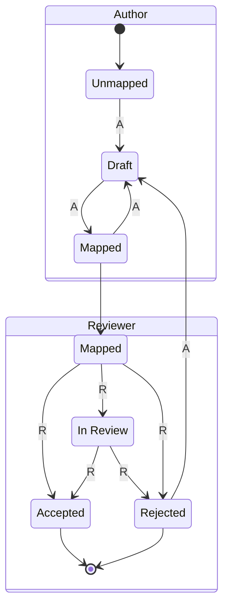
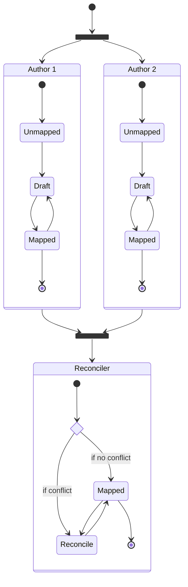
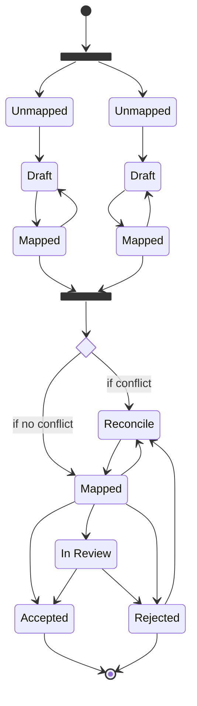

# Mapping Workflows

## Single author mapping, no review stage

## Single author mapping, with review stage

### Unified view

### Role-based view

## Dual author mapping, no review stage

## Dual author mapping, with review stage

