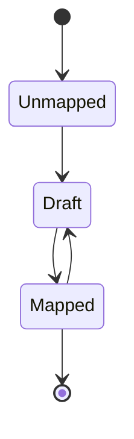
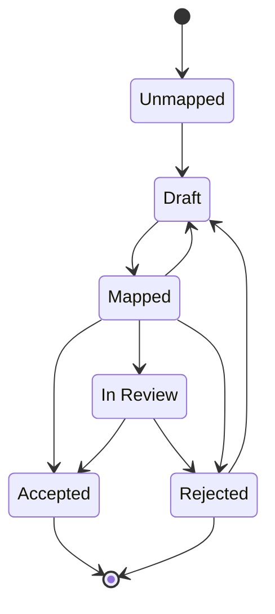
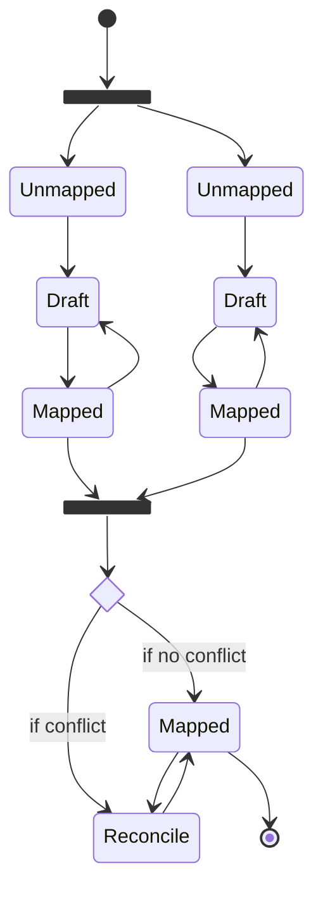
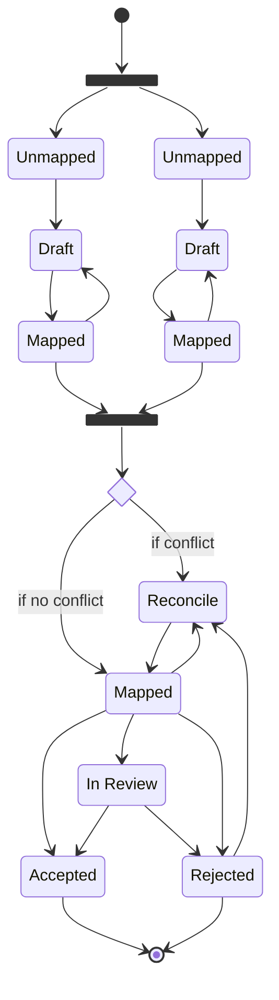

# Mapping Workflows

## Single author mapping, no review stage

```mermaid
stateDiagram-v2
   direction TB

   U: Unmapped
   D: Draft
   M: Mapped

   [*] --> U
   U --> D
   D --> M
   M --> D
   M --> [*]
```

## Single author mapping, with review stage

```mermaid
stateDiagram-v2
   direction TB

   U: Unmapped
   D: Draft
   M: Mapped
   I: In Review
   A: Accepted
   R: Rejected

   [*] --> U
   U --> D
   D --> M
   M --> D
   M --> I
   M --> A
   I --> A
   I --> R
   M --> R
   A --> [*]
   R --> [*]
   R --> D
```

## Dual author mapping, no review stage

```mermaid
stateDiagram-v2
   direction TB
   state fork_state <<fork>>
   state join_state <<join>>
   state if_conflict <<choice>>

   U1: Unmapped
   U2: Unmapped
   D1: Draft
   D2: Draft
   M1: Mapped
   M2: Mapped
   M: Mapped
   C: Reconcile

   [*] --> fork_state
   fork_state --> U1
   fork_state --> U2
   U1 --> D1
   D1 --> M1
   M1 --> D1
   M1 --> join_state
   U2 --> D2
   D2 --> M2
   M2 --> D2
   M2 --> join_state
   join_state --> if_conflict
   if_conflict --> M: if no conflict
   if_conflict --> C: if conflict
   C --> M
   M --> C
   M --> [*]
```

## Dual author mapping, with review stage

```mermaid
stateDiagram-v2
   direction TB
   state fork_state <<fork>>
   state join_state <<join>>
   state if_conflict <<choice>>

   U1: Unmapped
   U2: Unmapped
   D1: Draft
   D2: Draft
   M1: Mapped
   M2: Mapped
   M: Mapped
   C: Reconcile
   I: In Review
   A: Accepted
   R: Rejected

   [*] --> fork_state
   fork_state --> U1
   fork_state --> U2
   U1 --> D1
   D1 --> M1
   M1 --> D1
   M1 --> join_state
   U2 --> D2
   D2 --> M2
   M2 --> D2
   M2 --> join_state
   join_state --> if_conflict
   if_conflict --> C: if conflict
   if_conflict --> M: if no conflict
   C --> M
   M --> C
   M --> I
   M --> A
   I --> A
   I --> R
   M --> R
   A --> [*]
   R --> [*]
   R --> C
```
